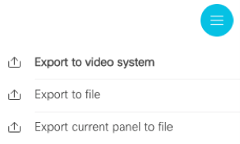

# Webex xAPI POST example

Example of a Macro running on a Cisco video endpoint that performs a POST action. In this case the macro calls my home automation system to switch ON/OFF/DIMM/COLOR a lamp.

**Equipment**: Cisco Webex DX80

**Firmware**: RoomOS 2019-02-22. The minimum CE firmware version is 9.6.1 (when HTTP POSTs were [introduced](https://community.cisco.com/t5/collaboration-voice-and-video/ce9-6-x-in-room-control-and-macros-usb-input-devices-http-post/ba-p/3765081 "introduced")).

**Connected**: The Cisco Webex video unit is registered to the Cisco Webex Teams cloud, but this should also work if it's registered on-premise.

**Setup**: This DX80 is connected to my home network. Firewall rules give it just enough access to make lamp on/off/dim/color API calls. Check out how the software was setup in the [feature introduction](https://community.cisco.com/t5/collaboration-voice-and-video/ce9-6-x-in-room-control-and-macros-usb-input-devices-http-post/ba-p/3765081 "feature introduction"). 

**NOTE**: you can do the same on other Cisco video units with Touch 10 panels.

# Flow
1. Press button on DX80 (to switch on a lamp)
2. Macro code (JS) detects button press and executes related code
3. This code does an API call (HTTP POST) to my home automation system
4. Home automation system executes requested action: lamp is ON!

# Steps
1. **Browse** to DX80 admin interface
2. **Login with admin rights**. This is needed for access to Macros
   the integrator role gives you access to the in-room control panel editor
3. **Launch the “In-Room Control” editor** (Integration menu) 
<kbd></kbd>

4. **Click “Launch Editor”** and build your screen(s)

5. **Save your screen** and see them in real live: press the <kbd></kbd> button (top-right) 

NOTE: don’t forget to export your configuration! Expand the top right menu: <kbd></kbd>

6. **Open the Macro editor** 
7. **Click “Create a new Macro”** 
8. **Paste the code** from the .js file in the editor and modify as needed
9. **Apply your code changes** by saving them
NOTE: below the code editor you find the console. When you use “console.log(‘abc’);” entries in your code the values will appear in the console. Great for troubleshooting.

10. **Save code changes** and Editor changes and test your code. 

 
 
 

# Resources

[Developere Portal](https://developer.cisco.com/site/roomdevices/ "Developere Portal")

Learning lab: [Introduction to xAPI for Cisco Collaboration Devices learning lab](https://learninglabs.cisco.com/lab/collab-xapi-intro/step/1)

Learning lab: [Creating custom In-Room Controls and Macros](https://learninglabs.cisco.com/lab/collab-xapi-controls/step/1)

Learning lab: [Customizing Collaboration Devices from Code](https://learninglabs.cisco.com/lab/collab-xapi-branding/step/1)

# Result

## "Office" Tab

## "Office" Tab in Designer

## "Home" Tab
This is the home tab, shared to give you an idea of what you could technically do.

